<h1 align="center">Power BI Data Model and Dashboard</h1>

  Interactive Business Intelligence solution covering executive monitoring,
  sales analysis, affiliate performance, engagement, outlet segmentation,
  logistics, delivery planning and geographical insights.

---

<h2>Dashboard Gallery</h2>

  <strong>Navigation Menu</strong>

  <a href="./dashboard-previews/01-navigation-menu.png">
    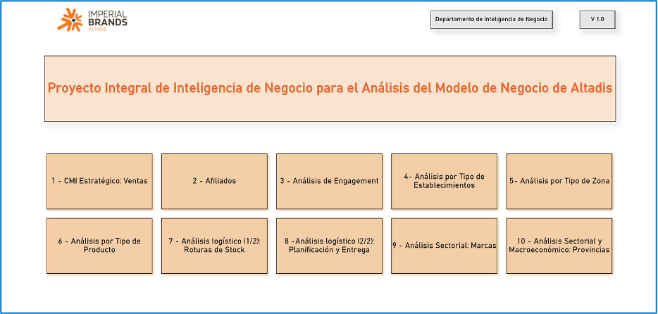
  </a>

<table width="100%">
<tr>
<td width="50%" align="center">
<strong>Dashboard Overview</strong>  
<a href="./dashboard-previews/02-dashboard-overview.png">
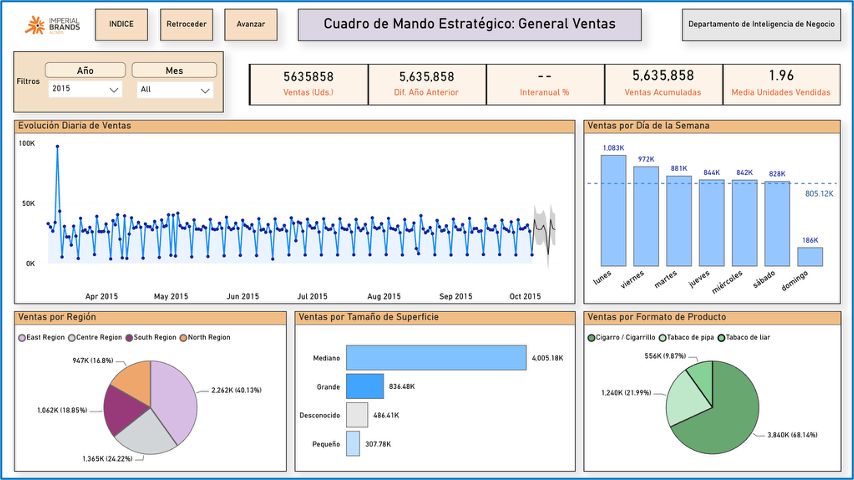
</a>
</td>
<td width="50%" align="center">
<strong>Sales Analysis</strong>  
<a href="./dashboard-previews/03-dashboard-sales.png">
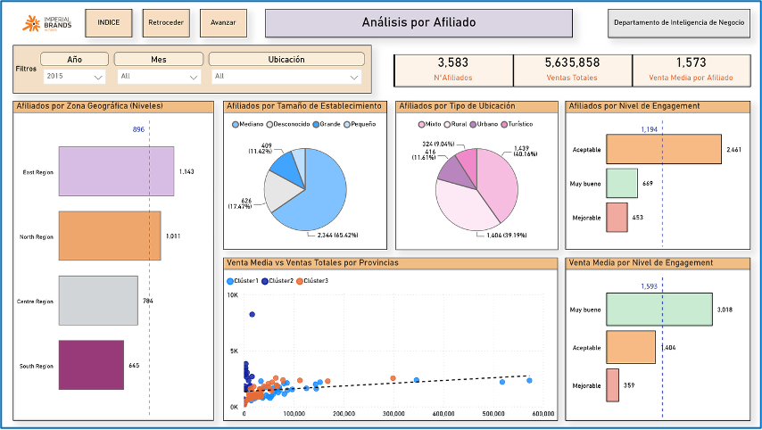
</a>
</td>
</tr>

<tr>
<td width="50%" align="center">
<strong>Affiliates Analysis</strong>  
<a href="./dashboard-previews/04-dashboard-affiliates.png">
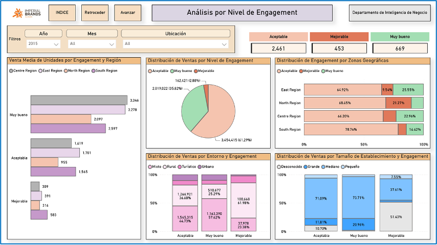
</a>
</td>
<td width="50%" align="center">
<strong>Engagement Analysis</strong>  
<a href="./dashboard-previews/05-dashboard-engagement.png">
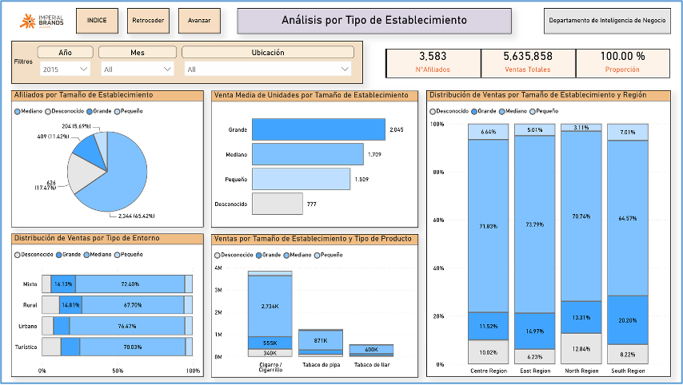
</a>
</td>
</tr>

<tr>
<td width="50%" align="center">
<strong>Outlet Types</strong>  
<a href="./dashboard-previews/06-dashboard-outlet-types.png">
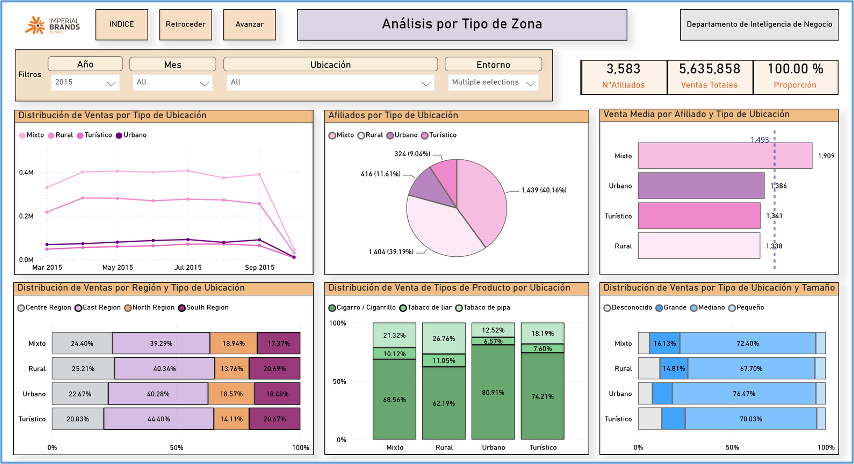
</a>
</td>
<td width="50%" align="center">
<strong>Zone Types</strong>  
<a href="./dashboard-previews/07-dashboard-zone-types.png">
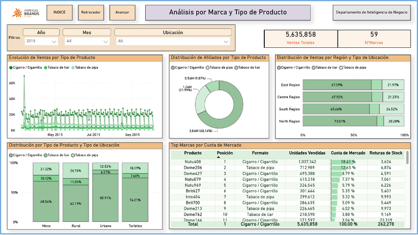
</a>
</td>
</tr>

<tr>
<td width="50%" align="center">
<strong>Product Types</strong>  
<a href="./dashboard-previews/08-dashboard-product-type.png">
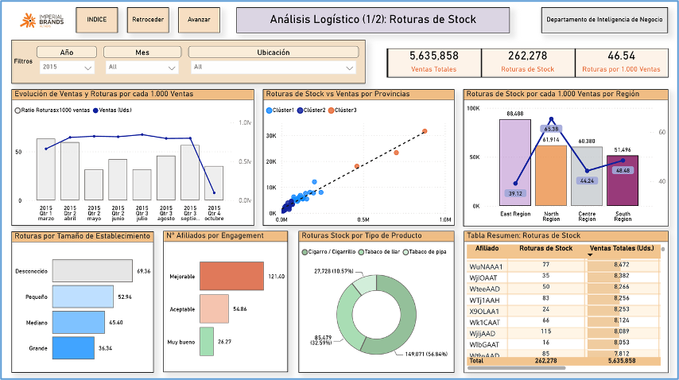
</a>
</td>
<td width="50%" align="center">
<strong>Stock and Routes</strong>  
<a href="./dashboard-previews/09-dashboard-stock-and-routes.png">
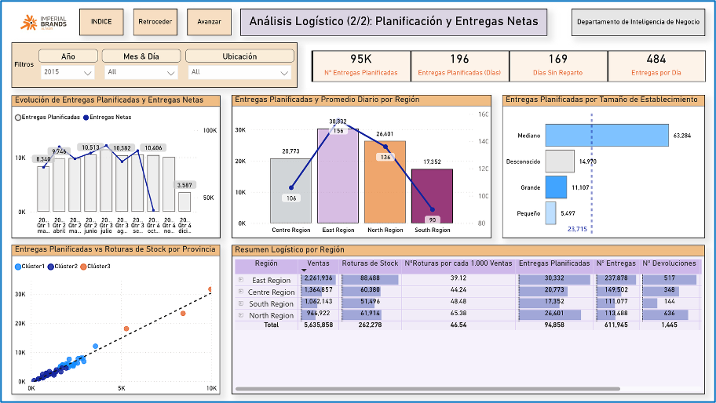
</a>
</td>
</tr>

<tr>
<td width="50%" align="center">
<strong>Delivery Planning</strong>  
<a href="./dashboard-previews/10-dashboard-delivery-planning.png">
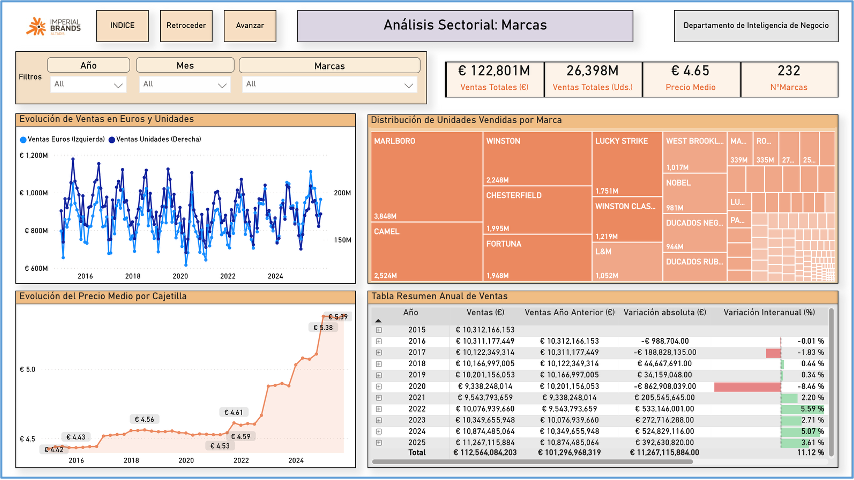
</a>
</td>
<td width="50%" align="center">
<strong>Sector and Provincial Analysis</strong>  
<a href="./dashboard-previews/11-dashboard-sector-and-provinces.png">
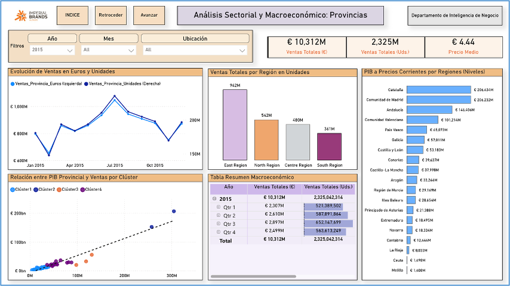
</a>
</td>
</tr>
</table>

  <em>Click any dashboard preview to open it in full size.</em>

---

<h2>Power BI Project File</h2>

  The complete editable Power BI project is currently available in Spanish.
  It includes all interactive report pages, the data model, Power Query
  transformations, DAX measures and the report navigation system.

  

